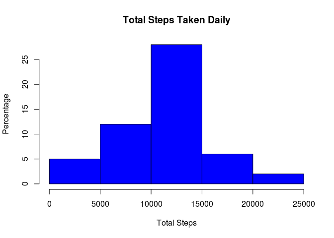
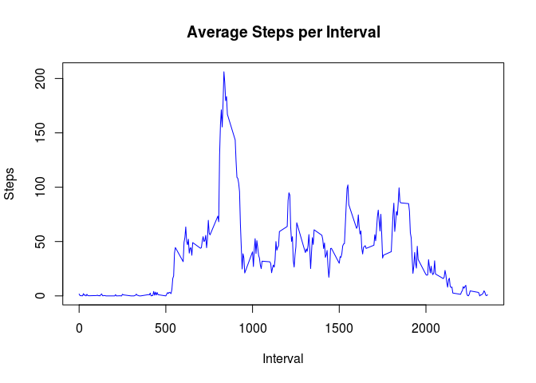
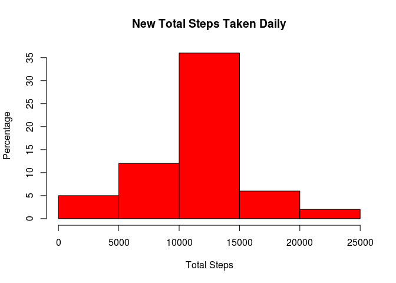
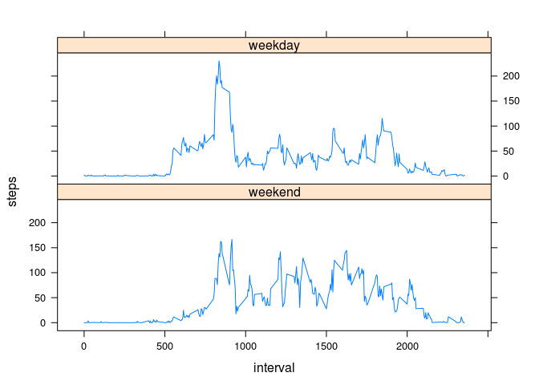

# Reproducible Research: Peer Assessment 1


## Loading and preprocessing the data

```r
data <- read.table(unz("activity.zip", "activity.csv"), header=TRUE, sep=",")
```
## What is mean total number of steps taken per day?
Daily Total Number of Steps taken Daily are...

```r
sum_table <- aggregate(steps ~ date, data = data, sum )

hist(sum_table$steps, col = "blue", main = "Total Steps Taken Daily", ylab = "Percentage", xlab = "Total Steps")
```

 

Mean and Median of steps taken...

```r
steps <- sum_table$steps
mean(steps)
```

```
## [1] 10766.19
```

```r
median(steps)
```

```
## [1] 10765
```

##What is the average daily activity pattern?


```r
# Create frame of average steps for each interval
averages <- aggregate(steps ~ interval, data, mean)

# plot averages frame

plot(averages, type = "l", col = "blue", main = "Average Steps per Interval", ylab = "Steps", xlab = "Interval")
```

 

```r
# Find Interval with highest Average of steps
maxtime <- averages[averages$steps == max(averages$steps),]
maxtime$interval
```

```
## [1] 835
```

## Imputing missing values


```r
# Calculate total number of NA values
sum(is.na(data[,1]))
```

```
## [1] 2304
```

```r
# reuse average value for each interval and name columns accordingly
names(averages) <- c("avg_interval", "avg_steps")
# replace NA values with average cast as an integer for that time interval in a new dataframe
newdata_tmp <- cbind(data, averages)
newdata_tmp$steps[is.na(newdata_tmp$steps)] <- as.integer(newdata_tmp$avg_steps[is.na(newdata_tmp$steps)])

newdata <- newdata_tmp[, 1:3]
# Repeat Step 1 with new dataset
new_sum_table <- aggregate(steps ~ date, data = newdata, sum )

hist(new_sum_table$steps, col = "red", main = "New Total Steps Taken Daily", ylab = "Percentage", xlab = "Total Steps")
```

 

Mean and Median of steps taken in New dataset compared with the old dataset...

```r
new_steps <- new_sum_table$steps
mean(new_steps)
```

```
## [1] 10749.77
```

```r
mean(steps)
```

```
## [1] 10766.19
```

```r
median(new_steps)
```

```
## [1] 10641
```

```r
median(steps)
```

```
## [1] 10765
```

Replacing the NA's with the averages for its specific interval had the effect of lowering both the mean and median. This would make sense since the NA's are ignored, but adding average values lessen the impact of the higher values.

## Are there differences in activity patterns between weekdays and weekends?


```r
# Use new dataset with filled in NA's
# Convert date to POSIXlt format
newdata$datepos <- strptime(newdata$date, format = "%Y-%m-%d")
# Create new Factor variable indicating Weekend or Weekday
newdata$weekend <- as.factor(ifelse(weekdays(newdata$datepos) %in% c("Saturday", "Sunday"), "weekend", "weekday"))

# Then create two subsets for weekend and weekday dates
endset <- newdata[which(newdata$weekend == "weekend"), ]
dayset <- newdata[which(newdata$weekend == "weekday"), ]
# get averages for each subset
avg_end_table <- aggregate(steps ~ interval, data = endset, mean )
avg_end_table$weekend <- as.factor("weekend")
avg_day_table <- aggregate(steps ~ interval, data = dayset, mean )
avg_day_table$weekend <- as.factor("weekday")
# bind the two sets together for plotting
full_week_table <- rbind(avg_end_table, avg_day_table)

# Make a panel plot of split by subsets
library(lattice)

xyplot(steps ~ interval | weekend, data = full_week_table, type = 'l', layout = c(1,2))
```

 

### Thank you for your attention
